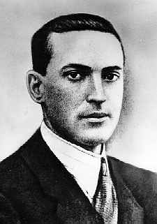

<p align="center">
  
</p>

<h1 align="center">Vygotsky</h1>

<p align="center"><em>A theory-building coding partner for <a href="https://docs.anthropic.com/en/docs/claude-code">Claude Code</a></em></p>

<p align="center">
  <a href="#tldr">TL;DR</a> · <a href="#install">Install</a> · <a href="#one-more-prompt">The Problem</a> · <a href="#the-evidence">The Evidence</a> · <a href="#how-it-works">How It Works</a>
</p>

---

<a id="tldr"></a>

**TL;DR:** AI coding tools produce code without understanding. In controlled studies, developers who delegate to AI score below 40% on conceptual mastery; developers who *inquire* with AI score 65%+. Vygotsky is a Claude Code plugin that structures every session around inquiry — building your mental model of the code alongside the code itself. It maintains a narrative learner diary, weaves theory checks into the conversation, tracks engagement, and adapts its interaction mode to where you are.

## Install

```bash
claude plugin install --url https://github.com/inji-kun/vygotsky
```

If you have superpowers enabled, disable it first — Vygotsky subsumes its capabilities:

```bash
claude plugin disable superpowers
```

From a local checkout: `claude --plugin-dir ./vygotsky`

**Requirements:** [Claude Code](https://docs.anthropic.com/en/docs/claude-code) with plugin support, Python 3.10+.

---

*The rest of this is an essay about why this plugin exists. If you just want to use it, you're done — it's installed.*

---

<a id="one-more-prompt"></a>

## One More Prompt

> *"AI coding tools are addictive and nobody's talking about it. Agentic coding triggers the same variable ratio reinforcement as slot machines — intermittent dopamine + adrenaline hits that make it near-impossible to stop. I ended up seeing a doctor because my brain wouldn't shut off at night — got prescribed medication to block wakefulness receptors just so I could sleep."*
>
> — **Quentin Rousseau**, [*One More Prompt*](https://blog.quent.in/posts/2026/03/09/one-more-prompt-the-dopamine-trap-of-agentic-coding/), March 2026

> *"I stopped working out because I didn't want to get out of my chair. I sat around in PJ's all day and didn't shower very often. Didn't brush my teeth. This is why I don't play slot machines."*

> *"I can do 1.5 months of work in a day so your brain literally never gets a chance to shut off."*

> *"I ended up fighting a lot with anyone who interrupted me while working. It's usual flow state but 100x due to 100x more context running in background."*

> *"It's very easy to run the wrong direction very quickly with AI, and feel like you're making progress without actually having a material impact on your goal."*

These are experienced developers describing a compulsive relationship with a coding tool that has no natural stopping point.

Meanwhile, on the other side:

> *"Testing AI-generated work became exhausting, like QA testing the work of a bad engineer. After sinking time into it, the result wasn't shippable, and they hadn't benefitted as a human being while working on it — no new skills to show."*

> *"More and more students struggle with basic concepts, almost always a consequence of relying too much on ChatGPT and vibe coding tools. Everything is fragmented and they don't get the feeling of accomplishment after finishing features."*

> *"AI coding tools promised to make us 1000x developers. Instead, many of us are drowning in half-finished projects, endless re-planning, and a strange new anxiety that comes from having TOO MUCH capability."*

> *"Dealing with AI coding is like wading through a swamp and leaves you exhausted."*
>
> — **Andrew Ng**

Two groups of people using the same tools, experiencing two sides of the same problem. One group can't stop. The other gets nothing from it.

What's going on?

---

## We've Seen This Before

The dominant UX paradigm for the last two decades has been: minimize friction, maximize engagement, optimize for ease of use. This is what good product design has meant since the iPhone — make it seamless, remove every obstacle between the user and the action.

In the 2000s, this paradigm found its business model: the attention economy. Social media feeds, notification systems, infinite scrolls — all engineered to capture and hold human attention, because attention could be sold to advertisers. The side effects — anxiety, sleep disruption, compulsive checking, shortened attention spans — were not the intent. They were the natural consequence of optimizing for engagement without asking what that engagement *cost* the person.

Now the same paradigm has produced its inversion. You might call it the inattention economy.

The pitch from AI coding tools is: *you don't need to pay attention to the details anymore*. Let the agent handle it. Let it write the code, debug the code, review the code. Your job is to direct, not to understand. The value proposition is your *disengagement* from the substance of your own work — the less you need to understand, the more valuable the tool.

The people building these tools are talented engineers following the same UX playbook that produced every great product of the last twenty years: remove friction, increase ease, ship faster. The problem is that the playbook's optimization target — frictionless use — is wrong for tools that shape human capability.

The side effects mirror Web 2.0's, inverted:

- **Attention economy**: compulsive *engagement* with content you don't need — anxiety, shortened attention spans, loss of deep focus
- **Inattention economy**: compulsive *delegation* of work you don't understand — anxiety, loss of competence, growing codebases nobody can maintain

Different mechanism, but the same gap between what the tool makes you *feel* (productive, powerful, fast) and what it actually *produces* in the person using it (dependence, erosion of understanding, a degraded relationship to your own work).

Garry Tan stayed up 19 hours coding with Claude Code and publicly called himself "addicted" — and the community celebrated it. Steve Yegge described sprinting out of the room and slamming the door to stop himself coding at 2 AM. These are stories of a reward loop that has become decoupled from the thing it's supposed to reward.

It would be a shame if AI — arguably the most consequential technology of this era — followed the same trajectory as social media. Not because the technology is bad, or because anyone has bad intentions, but because the UX paradigm needs to evolve for tools that shape what people can do.

### From UX to RX

UX asks: *was that easy?* Was the interaction smooth? Did the user accomplish their task with minimal friction?

RX asks a different question: *what remained after the tool was closed?*

RX stands for Razvitie Experience — from развитие (*razvitie*), the Russian word Lev Vygotsky used for the specific kind of development that happens in the Zone of Proximal Development. Razvitie means something like "unfolding of capability" — something becoming what it has the potential to become. It's broader than "learning" (which sounds like school) and more specific than "growth" (which sounds like self-help).

*Non scholae sed vitae discimus* — we learn not for school, but for life. RX takes this seriously as a design criterion. The measure of a tool is not how it felt to use, but what the person can do — in their work, in their craft — that they couldn't do before.

This isn't opposed to UX. Ease of use still matters, and friction for its own sake is just bad design. But RX adds a question that UX doesn't ask: does this interaction leave the person more capable, or more dependent? If your tool is frictionless but the person who uses it for a year understands less than when they started, something has gone wrong — and it's not a side effect. It's the predictable outcome of optimizing for the wrong thing.

Vygotsky is an attempt to implement RX for software development.

---

<a id="the-evidence"></a>

## The Evidence

### The Perception-Reality Gap

The [METR Study](https://metr.org/blog/2025-07-10-early-2025-ai-experienced-os-dev-study/) (July 2025) ran a randomized controlled trial with 16 experienced open-source developers — average 22,000+ stars, 1M+ lines of code — working on their own repositories:

- Developers took **19% longer** with AI tools
- They expected AI to speed them up by **24%**
- After experiencing the measured slowdown, they *still believed* AI had sped them up by **20%**
- AI introduced "extra cognitive load and context-switching"

This is not a misunderstanding. It is a documented cognitive phenomenon: **automation complacency** — the same thing that causes airline pilots to miss instrument warnings, nuclear plant operators to overlook anomalies, and drivers to rear-end the car in front of them while autopilot is engaged. Decades of human factors research predicted this. We just didn't think it would happen to developers.

The [JetBrains Developer Survey](https://www.jetbrains.com/lp/devecosystem-2025/) (24,534 developers, 194 countries) confirmed the pattern at scale: **90%** report saving time, while controlled studies show the opposite. Satisfaction dropped from **70%+ to 60%** in a single year — the gap between perceived and actual productivity seems to be closing, and not in the direction people expected.

### Inquiry vs. Delegation

The [Anthropic Skills Study](https://www.anthropic.com/research/learning-skills-with-ai) (January 2026) — a randomized controlled trial with 52 engineers — found the mechanism:

- AI-assisted developers scored **17% lower** on conceptual mastery — nearly two letter grades
- AI reduced task completion time by up to **80%**
- Speed came at the *direct cost* of understanding

But the critical finding was not the average — it was the variance:

- Developers who used AI for **conceptual inquiry** — asking why, probing assumptions, requesting explanations — scored **65%+**
- Developers who used AI for **code delegation** — letting it generate solutions — scored **below 40%**

The difference between these groups was not ability or experience — it was mode of engagement. The tool, the tasks, and the population were the same. The outcomes were wildly different depending on whether the developer was thinking with the AI or delegating to it.

> *"Rather than eliminating time pressure, LLM use shifted it from debugging to understanding, verifying, and documenting AI-generated solutions."*

### Why This Happens: The Cognitive Science

**The 10-bit bottleneck.** Caltech researchers (2024) quantified what designers have intuited for decades: conscious human thought operates at approximately **10 bits per second**. Sensory systems gather a billion bits per second. Any tool that dumps information at compute speed is fighting human neurology. The streaming text that makes an AI agent look impressively fast is, from the perspective of human cognition, a firehose aimed at a teacup.

**Cognitive load theory.** John Sweller (1988) distinguished three types of cognitive load. *Intrinsic* load is the complexity inherent in the task — you can't reduce it. *Extraneous* load is the extra effort imposed by poor information design — undifferentiated text streams, context that scrolled away, information presented faster than you can process it. *Germane* load is the effort devoted to building understanding — the productive struggle of figuring something out. Most developer tools minimize all cognitive load indiscriminately, treating friction as universally bad. This is wrong. Extraneous load should be eliminated. Germane load should be *cultivated*. The right kind of friction — at the right moment, at the right intensity — is what produces understanding.

**The fragility of attention.** Gloria Mark's research at UC Irvine showed that it takes approximately **25 minutes** to refocus after an interruption. People compensate by working faster, which increases stress and cortisol. The mere *possibility* of notification creates anticipatory anxiety, even when no notification comes. Flow states are fragile and valuable. Importantly, **self-interruptions** (choosing to check something) cost less than external interruptions — the nervous system responds differently to voluntary versus involuntary attention shifts. A well-placed theory check, one that the developer experiences as part of the work rather than an interruption to it, doesn't carry a 25-minute refocus cost. It's collaborative thinking, not a context switch.

**What disengagement actually looks like.** The developer who types "ok" and "y" and hopes for the best isn't lazy. They've hit the point where extraneous cognitive load has overwhelmed their capacity to process, and they've switched from trying to understand to trying to get through it. Sweller's framework predicts this: when total load exceeds working memory, germane processing — the kind that builds understanding — is the first thing to go. The developer who can't stop coding at 2 AM isn't unusually disciplined either. Rousseau identified the mechanism: variable ratio reinforcement, the same schedule that makes slot machines compelling. Neither state produces understanding, and both are predictable responses to an interaction design that offers no calibration and no natural stopping points.

---

## Programming as Theory Building

Peter Naur ([1985](https://pages.cs.wisc.edu/~remzi/Naur.pdf)) argued that programming is not the production of code but the building of a **theory** — a mental model of the problem domain, the solution architecture, and the relationship between them. Code is an artifact of theory. Without the theory, the code is unmaintainable, even if it works perfectly.

When the Hacker News community rediscovered Naur in July 2025 — after the METR study showed AI makes experienced developers slower — the connection was immediate: AI disrupts theory-building. The developer who accepts AI-generated code without building a theory of it has acquired a liability, not an asset. When the code breaks, the absence of theory means they cannot debug, extend, or reason about it.

But "struggle" — the traditional mechanism for theory construction — is really just a word for germane cognitive load. And germane load can take forms other than writing code by hand. The Anthropic study showed this: the tight communication loop between human and AI — asking why, probing assumptions, predicting outcomes — *is* the productive struggle. It just doesn't look like what struggle used to look like.

Lev Vygotsky ([1896–1934](https://en.wikipedia.org/wiki/Lev_Vygotsky)) showed that cognitive development happens in the space between what you can do alone and what you can do with guidance — the *Zone of Proximal Development*. The guidance must be calibrated. And critically, the scaffolding must *fade*: good guidance creates competence, then withdraws. Yesterday's guided discovery becomes today's autonomous skill.

The synthesis: the developer's job is to construct and maintain the theory. The AI's job is twofold — **compile that theory into executable code**, and **scaffold the theory-building itself**. The AI is not just a code generator. It is a collaborator in the thinking — not just producing code, but participating in the conversation that builds your understanding of it.

---

<a id="how-it-works"></a>

## How It Works

Vygotsky is a [Claude Code plugin](https://docs.anthropic.com/en/docs/claude-code/plugins) that restructures how Claude interacts with you. It replaces [superpowers](https://github.com/anthropics/claude-plugins-official).

### The Learner Diary

Claude maintains a **narrative diary** of what you've demonstrated understanding of, organized by concept. No numbers, no grades, no scores — just timestamped observations:

> *"Traced the race condition in the WebSocket handler back to the missing mutex on shared state. Explained why the lock needs to be per-connection, not global — understands the performance trade-off."*

Why narrative instead of numeric? Because "React: 7/10" tells you nothing. "Understands the virtual DOM diffing algorithm and why keys matter for list reconciliation, but hasn't worked with concurrent mode or Suspense boundaries" tells you everything. Numbers compress away the information that matters.

Concepts are cross-linked with `[[wiki-links]]`. The diary builds across sessions — so Claude never re-explains what you already know, and never assumes you know what you haven't demonstrated.

### Theory Checks

Throughout the session, Claude weaves in moments that check whether you're building a theory of the code — not after the fact, but as part of the conversation. When it's about to implement a design choice, it might walk you through the reasoning and ask if it matches your mental model. When you're navigating unfamiliar code, it might ask you to predict what a function does before reading it together. When a test fails, it might ask what you think went wrong before jumping to the fix.

The tone is always collaborative — a colleague thinking out loud, not a teacher quizzing you:

> *"So this migration drops the `legacy_users` table after copying to `users_v2`. If the copy fails halfway, we'd need to restore from backup — there's no rollback path built in. That feel right, or should we add a verification step?"*

Never: *"Can you explain what this migration does?"*

The difficulty of the question is the same. The experience of being asked is completely different. One triggers defensiveness; the other triggers thinking.

For destructive operations — force pushes, schema migrations, `rm -rf` — a hook enforces the check as a hard gate: Claude won't proceed until you've engaged with the consequences. But most theory checks are softer than that. They're woven into the flow of work, and they adapt: if you're clearly on top of the material, they fade. If you're rubber-stamping, they become more concrete.

### Engagement Tracking

Three rubber stamps in a row — "looks good", "sure", "go ahead" — and Claude adjusts. Theory checks become more concrete. Batch sizes shrink. The interaction mode shifts to give you more surface area to engage with.

The developer typing "ok" and "y" is present but not processing — germane cognitive load has dropped to zero. Vygotsky detects this and responds not with a penalty, but with a recalibration that makes re-engagement easier.

### Four Interaction Modes

Vygotsky's central insight was that the Zone of Proximal Development is narrow, personal, and dynamic — what stretches one person paralyzes another, and where you are shifts as you work. The plugin operationalizes this through four modes, arranged on two axes: how much skill you've demonstrated in the current domain, and how engaged you are right now.

|  | **High engagement** | **Low engagement** |
|---|---|---|
| **High skill** | **Extension** — scaffolding fades. Larger batches, light-touch theory maintenance. You drive. | **Sparring** — you have the skills but you're skimming. Claude surfaces trade-offs and asks for your reasoning on decisions that matter. |
| **Building skill** | **Senior Peer** — the highest-leverage mode for growth. Claude breaks tasks into steps, invites you to predict outcomes, builds the theory collaboratively. | **Brake Pedal** — unfamiliar territory plus low engagement is the highest-risk state. One concept at a time. Walk through what the code actually does before changing it. |

The modes are not rewards or punishments. Extension is where scaffolding has done its job and withdraws — this is the Vygotskian fade, not a gold star. Brake Pedal is not a penalty for being disengaged; it's the recognition that when someone has stopped processing (typing "ok", "sure", "go ahead"), pushing harder makes it worse. You shrink the scope until re-engagement becomes possible.

Transitions happen within a session and in both directions. You might start in Senior Peer, demonstrate solid understanding, shift to Extension — then hit an unfamiliar subsystem and move back to Senior Peer. Claude announces transitions explicitly ("This touches patterns I haven't seen you work with before — I'll walk through the design with you") so you always know why the interaction feels different.

### 10 Workflow Skills

| Skill | Core principle |
|-------|---------------|
| **brainstorming** | No code until you've *engaged* with the trade-offs — not just approved them |
| **writing-plans** | Concept-tagged tasks with theory-check points at abstraction boundaries |
| **executing-plans** | Batch reports with "what this means." Batch size adapts to mode. |
| **systematic-debugging** | No fix without a root cause. Hypotheses formed *together*. |
| **test-driven-development** | One sentence on what each test proves and why it matters |
| **dispatching-parallel-agents** | You understand the shape *before* and the meaning *after* |
| **verification-before-completion** | "Should work" is not verification |
| **using-git-worktrees** | Always oriented on which directory holds which state |
| **finishing-a-development-branch** | Merge strategies with enough context to choose |
| **writing-skills** | Meta-skill for extending Vygotsky while preserving its soul |

---

## Architecture

```
┌─────────────────────────────────────────────────┐
│  SKILL.md — Claude's operating posture          │
│  "The soul." Loaded at session start.           │
│  Tone, theory-building discipline,              │
│  anti-sycophancy engineering.                   │
├─────────────────────────────────────────────────┤
│  Hooks — Safety floor                           │
│  SessionStart: injects context + session marker │
│  PreToolUse: theory-check on destructive ops    │
│  UserPromptSubmit: passive engagement detection │
├─────────────────────────────────────────────────┤
│  MCP Server — State management                  │
│  Learner diary · Plan tree · Quadrant state     │
│  Engagement signals (narrative, not numeric)    │
└─────────────────────────────────────────────────┘
```

State persists in `~/.vygotsky/` across sessions.

---

## What This Looks Like in Practice

A developer using Vygotsky finishes a session having:

- **Constructed a theory** of the software being built — their primary contribution
- **Produced working code** that faithfully compiles that theory — the AI's contribution
- **Built understanding through collaboration** — the AI scaffolded the theory construction through well-placed questions, walkthrough moments, and predictions
- **Developed skills that transfer** beyond this session — recorded in the diary

You can close your laptop at a reasonable hour. Not because you lack ambition, but because you know what was built, why it's shaped that way, and what to do next. There's no compulsion to check on agents at 2 AM, because you're not a spectator watching a slot machine — you're someone who understands what was built and can trust the result.

The felt productivity matches the actual productivity. The satisfaction doesn't decline over time. It deepens.

---

## Related Work

Most AI coding tools optimize for task completion speed — how fast can the code be written, how little does the developer need to do. That's a reasonable goal, and these tools are genuinely good at it. But it leaves open the question of what happens to the developer's understanding over time.

AI coding agents (Claude Code, Cursor, Copilot) optimize for getting the code written. Multi-agent terminals (cmux, Architect, Termoil) optimize for throughput across parallel tasks. AI code review tools (CodeRabbit, Codacy) optimize for correctness. Vibe coding tools (Cursor, Windsurf) optimize for ease of use. None of them ask whether you understood what was produced, or whether you could reproduce, debug, or extend it on your own.

Vygotsky tries to.

---

## References

- **METR** (2025). *Measuring the Impact of Early-2025 AI on Experienced Open-Source Developer Productivity.* [metr.org](https://metr.org/blog/2025-07-10-early-2025-ai-experienced-os-dev-study/)
- **Anthropic** (2026). *How AI Assistance Impacts the Formation of Coding Skills.* [anthropic.com/research](https://www.anthropic.com/research/learning-skills-with-ai)
- **JetBrains** (2024–2025). *Developer Ecosystem Survey.* 24,534 developers, 194 countries.
- **Peter Naur** (1985). *Programming as Theory Building.* Microprocessing and Microprogramming 15.
- **Lev Vygotsky** (1978). *Mind in Society: The Development of Higher Psychological Processes.*
- **Gloria Mark** (2023). *Attention Span: A Groundbreaking Way to Restore Balance, Happiness and Productivity.* HarperCollins.
- **John Sweller** (1988). *Cognitive Load During Problem Solving.* Cognitive Science 12(2).
- **Caltech** (2024). *The 10-Bit Bottleneck: Quantifying Conscious Information Processing.*
- **Quentin Rousseau** (2026). *One More Prompt: The Dopamine Trap of Agentic Coding.* [blog.quent.in](https://blog.quent.in/posts/2026/03/09/one-more-prompt-the-dopamine-trap-of-agentic-coding/)

---

## Development

```bash
claude --plugin-dir .   # run locally
conda run -n Vygotsky python3 -m pytest tests/ -v   # run tests
```

## License

MIT
